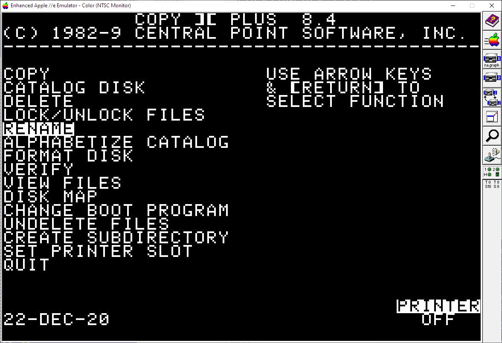
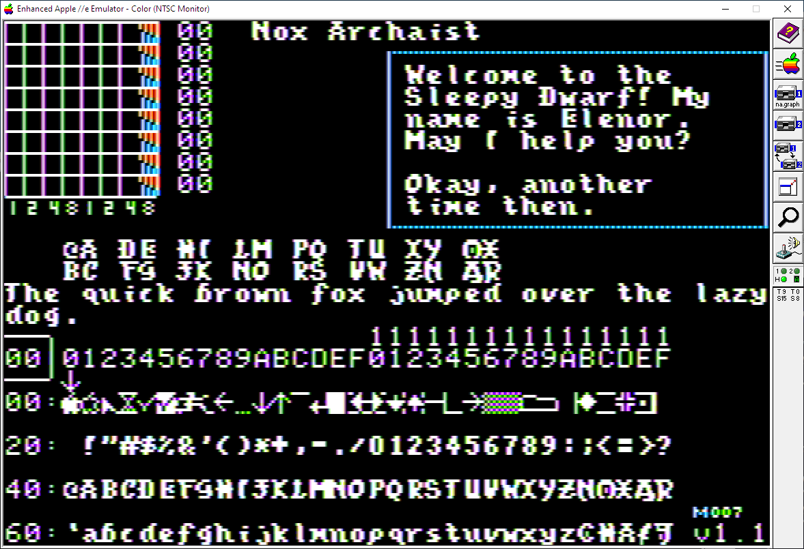

# (Unofficial) Nox Archaist Utilities

# Table of Contents

* [Introduction](#introduction)
* [Built-in Fonts](#built-in-fonts)
* [Before you change the font](#before-you-change-the-font)
* [Changing Fonts](#changing-fonts)
  * [CiderPress](#ciderpress)
  * [Copy \]\[+](#copy-)
  * [Command Line](#command-line)
* [Example Fonts](#example-fonts)
  * [Font: Where in the World is Carmen Sandiego](#font-where-in-the-world-is-carmen-sandiego)
  * [Font Gothic](#font-gothic)
  * [Font Byte](#font-byte)
* [Font Editor](#font-editor)
  * [Select Mode Keys](#select-mode-keys)
  * [Edit Mode Keys](#edit-mode-keys)

# Introduction 

_Context:_ I was one of the programmers on _Nox Archaist._ I asked Mark if I could share the Font Editor
we used for the game that I wrote and Mark said _"Sure!"_ 

Here are my unofficial collection of utilities that I think all Nox Archaist fans will be interested in.

**DISCLAIMER:** This project is NOT affiliated with 6502workshop in any way, shape or fashion. This is an UNOFFICIAL mod and UNSUPPORTED software by a fan who also helped worked on the game and toolchain.

# Built-in Fonts

Nox Archaist comes with 2 great fonts out-of-the-box:

* `FONT1` -- A "Runic-inspired" Nox Archaist font
  * 
* `FONT2` -- A traditional Apple 2 "thin" font
  * 

Would you prefer a different font that _you_ might find more readable or stylistic?

/Oblg. _"Have I got a deal for you!"_

  * Carmen 
  * Gothic 
  * Byte   

As shown above I've included a few different fonts to pick from.

Now there are a couple different ways to replace the font used in Nox Archaist depending
on if you are more comfortable with utilities or the command line. I'll go over
both methods.

I will eventually be writing a utility to streamline all of this but for right
now be patient with the extra verbose description. It looks more complicated
 then it really is -- due to showing pictures for _every_ step of the way.

# Before you change the font

**NOTE:** You need to start/continue a Nox Archaist game before you can switch the font! At this time you _CAN NOT_ change the font from the Main Menu -- only in-game.

1. Start Nox Archaist
2. Either continue or make a new game.
3. When you see your avatar in game:

 * Press `TAB` to show the party summary
   
 * Press `TAB` again to show the character summary
   
 * Press `6` to switch to the in-game options panel
   
 * Press `UP ARROW` to select `Toggle Font`
   
 * Press `RETURN` to toggle the font. You will see a message that you need to save your game and reboot before the new font takes effect
   
 * Press `ESC` to quit the options dialog
 * Press `Q` to save the game
   
 * Wait for saving to finish
   

Before you re-boot Nox Archat let's install a new, second font.

# Changing Fonts

There are many different ways to replace the fonts in _Nox Archaist._
The easiest way is probably to use [CiderPress](https://a2ciderpress.com/) but using _Copy \]\[+_ or
even the command line aren't hard.

Let's walk through and example using the font from _Where in the World is Carmen Sandiego_ showing
3 common ways.

## CiderPress

1. Stop any emulator(s) that have the Nox Archaist HDV image mounted, or "unplug" the hard drive.
2. Start CiderPress
3. File > Open > `NA.GRAPHICS.dsk`
4. Select: `FONTS:CARMEN.FONT`
5. Edit > Copy
6. File > Open > `Nox Archaist HDV (v1001).HDV`
7. Select directory `NA`
8. Edit > Paste
9. Rename the old `NA:FONT2` to `FONT2.BACKUP` via Actions > Rename
10. Rename `NA:CARMEN.FONT` to `FONT2` via Actions > Rename
11. Close CiderPress and fire up Nox Archaist in your favorite emulator!

## Copy ][+ 

If you wist to use Copy \]\[+ to copy the font you will need to use a
latter version that supports ProDOS such as 8.4.

1. Start your emulator
2. Mount the floppy disk/hard drive with Copy \]\[+ and start it
3. Mount the `NA.GRAPHICS.dsk` floppy disk -- (Slot 6, Drive 1 for me)
4. Mount the `Nox Archaist HDV (v1001).HDV)` hard disk drive image -- (Slot 7, Drive 1 for me)
5. Copy 2 files from the `NA.GRAPHICS` disk: `FONT.EDIT` and `CARMEN.FONT` to the Nox Archaist Hard Drive. Specifically:

 * Copy
   * 
 * Files
   * 
 * Select Slot 6, Drive 1 -- the `NA.GRAPHICS` floppy source
   * 
 * Select Slot 7, Drive 1 -- the _Nox Archaist_ hard drive destination
   * 
 * Select the source `FONTS` sub-directory on `NA.GRAPHICS`
   * 
 * Select `FONT.EDIT`
   * 
 * Select `CARMEN.FONT`
   * 
 * Press `G` to copy
 * Select the `NA` sub-directory destination
   * 
 * Copying ... 
   * 
 * ... and this step is done. 
 
6. Rename the Nox Archaist `FONT2` to `FONT9` to back it up.

 * Rename
   * 
 * Files
   * 
 * Select _Nox Archaist_ hard drive
   * 
 * Select destination `NA` sub-directory
   * 
 * Select `FONT2` file
   * 
 * Press `RETURN` to rename it to `FONT9`
   * 
 * Press `G` to execute...
   * 
 * .. and this step is done.

7. Rename the `CARMEN.FONT` to `FONT2`
8. Reboot _Nox Archaist_

## Command Line

To manually replace the font:

1. Start your emulator
2. Mount the `NA.GRAPHICS.dsk` disk in your emulator in Slot 6, Drive 1.
3. _Unmount_ any hard drive images in your emulator
4. Re-boot. (In _AppleWin_ this is `F2`. In other emulators you may need to press **Ctrl-Reset** in your emulator and type `PR#6`)
5. Mount the `Nox Archaist HDV (v1001).HDV)` hard drive image in your emulator in Slot 7, Drive 1.
6. Press `DOWN ARROW` to navigate down to `BASIC.SYSTEM`
7. Press `RETURN` to start BASIC
8. Copy the font you wish to use over
```
    BLOAD /NA.GRAPHICS/FONTS/CARMEN.FONT,A$C00
    BSAVE /NOXARCHAIST/NA/FONT2,A$C00,L$300
```
9. Reboot Nox, Continue, and enjoy!
```
    PR#7

```
**TL:DR;**
  * 

# Example Fonts

## Font: Where in the World is Carmen Sandiego

```
    BLOAD /NA.GRAPHICS/FONTS/CARMEN.FONT,A$C00
    BSAVE /NOXARCHAIST/NA/FONT2,A$C00,L$300
    PR#7
```

## Font: Gothic

Same instructions as above but the TL:DR; version is:

```
    BLOAD /NA.GRAPHICS/FONTS/CHR.GOTHIC,A$C00
    BSAVE /NOXARCHAIST/NA/FONT2,A$C00,L$300
    PR#7
```

## Font: Byte

Same instructions as above but the TL:DR; version is:

```
    BLOAD /NA.GRAPHICS/FONTS/CHR.BYTE,A$C00
    BSAVE /NOXARCHAIST/NA/FONT2,A$C00,L$300
    PR#7
```
# Font Editor

The font editor used on Nox Archaist is included! 

* 
* 

You can either:

* Boot the `NA.GRAPHICS` disk
  * Use arrow keys to select `FONTS`
  * Press `RETURN`
  * Select`FONT.EDIT`
  * Press `RETURN`
* From the command line:
  * `PREFIX /NA.GRAPHICS/FONTS`
  * `-FONT.EDIT`

From the Font Editor, press `ESC` to quit.

It has two modes:

* SELECT character mode, and
* EDIT  characater mode

## Select Mode Keys

It defaults to `SELECT` character mode. The keys available in this mode are:

```
    RET Edit glyph
    ESC Quit

    I   Select Prev Row
    J   Select Prev Char
    K   Select Next Row
    L   Select Next Char

    i   Select Prev Row
    j   Select Prev Char
    k   Select Next Row
    l   Select Next Char

    ^   Select Prev Row
    <-- Select Prev Char
    v   Select Next Row
    --> Select Next Char

    0   Load NOX.FONT
    1   Load FONT1
    2   Load FONT2
    3   Load FONT3
    4   Load FONT4
    5   Load FONT5
    6   Load FONT6
    7   Load FONT7
    7   Load FONT8
    7   Load FONT9

    Shift-0   Save NOX.FONT
    Shift-1   Save Font 1
    Shift-2   Save Font 2
    Shift-3   Save Font 3
    Shift-4   Save Font 4
    Shift-5   Save Font 5
    Shift-6   Save Font 6
    Shift-7   Save Font 7
    Shift-8   Save Font 8
    Shift-9   Save Font 9
```

## Edit Mode Keys

The keys in `EDIT` character mode are:

```
    RET Update glyph, return to select mod
    ESC Cancel glyph, return to select mod

    I   Move Up
    J   Move Left
    K   Move Down
    L   Move Right

    i   Move Up
    j   Move Left
    k   Move Down
    l   Move Right

    ^   Select Prev Row
    <-  Select Prev Char
    v   Select Next Row
    ->  Select Next Char
    SPC Toggle pixel on/off
```

# Themes / Skins / Alternate Tile-sets
## Ultima 4

In progress ...


# Floppy Disk Verifier

In progress ...

# Updated

Version 1
Last Updated Dec 22, 2020

